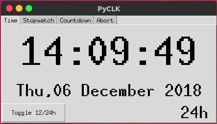
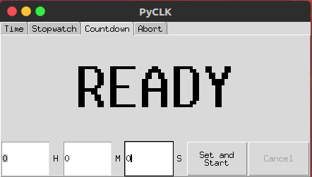
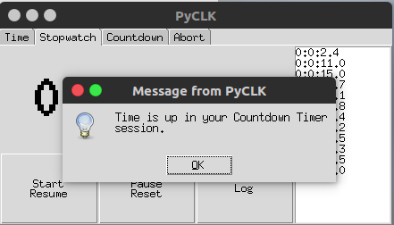
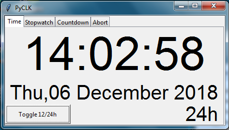
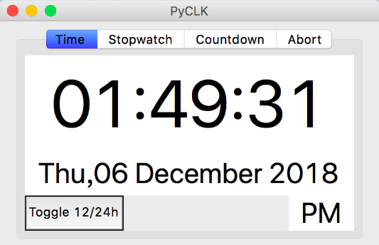

# PyCLK

Single file Python clock with tkinter GUI, part of university coursework.
No other libraries needed besides python.org Python3 built-in libraries.

Call with Python3.

Works best on GNU/Linux (Ubuntu 16.02) machine
Also tested on MS Windows 7 and Apple macOS Mojave

